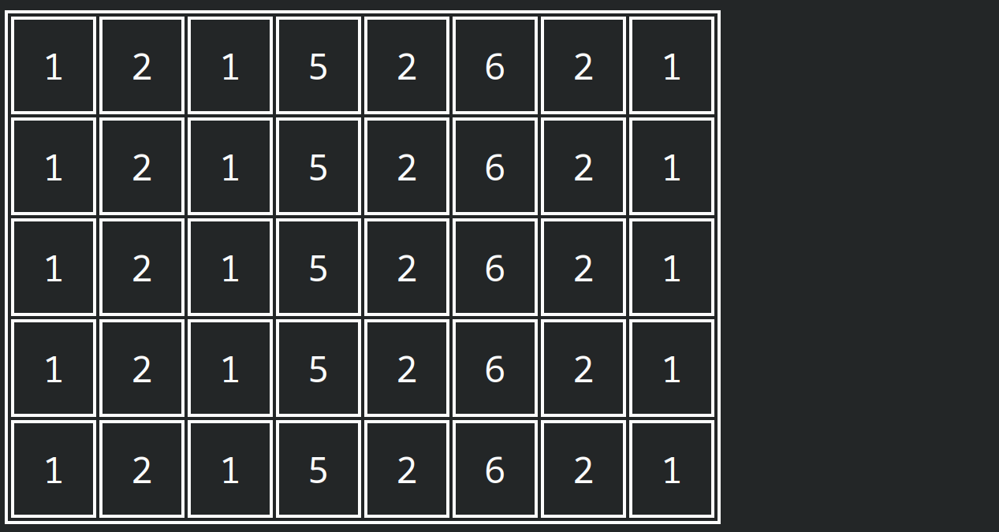
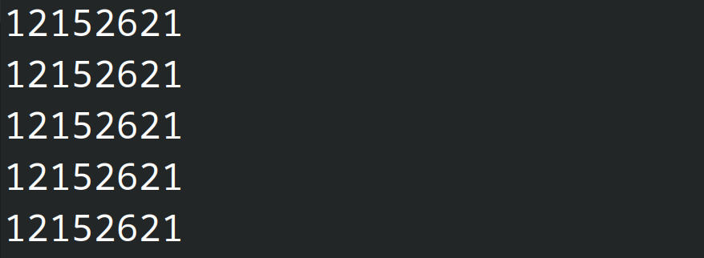

# libdio

Input / Output library for the PRG1F course. Smart abstractions to ask for user inputs, and display things to the console (colors, display grid).

## Usage

To use this library in your code, you have to add the following lines in your `CMakeLists.txt`:

```cmake
include(FetchContent) # once in the project to include the module

FetchContent_Declare(libdio
        GIT_REPOSITORY https://github.com/HEIGVD-PRG1-F-2022/libdio.git
        GIT_TAG v0.2.0
        )
FetchContent_MakeAvailable(libdio)

# Here are your other declarations, like `add_executable`

# Replace `PROJECT` with the name of your executable
target_link_libraries(PROJECT PRIVATE libdio)
```

Now you can do the following to include the library in your files:

```c++
#include <libdio/display.h>
#include <libdio/input.h>
```

## Features
See a code example [here](example/main.cpp).

### Display text and colors
The Display class can be used with or without an object.

**Normal text**  
To display a text in white, simply use the method `showText()`:
```cpp
Display::showText("Hello !!");
```

**Support of colors**  
libdio supports ANSI colors, and a few common colors are included. Here is the full list and their ANSI codes
```cpp
enum Colors {
	WHITE = 15,
	YELLOW = 226,
	ORANGE = 214,
	RED = 196,
	AQUA = 122,
	PINK = 207,
	GREEN = 40,
	BLUE = 21,
	BLACK = 16
};
```
And a visual test of these colors:  


But you can cast any integer value of an ANSI color to get a custom color that is not listed above. For example with the color 148:
```cpp
Display::showText(msg, (Display::Colors) 148);
```


All the following ANSI codes can be used!

*Source: [8 bit ANSI codes on Wikipedia](https://en.wikipedia.org/wiki/ANSI_escape_code#8-bit)*

You want a quick view of all colors in your terminal ? Use this snippet:  
```cpp
for (int i = 0; i < 256; i++) {
	Display::showText("Text in custom color (code = " + to_string(i) + ")", (Display::Colors) i);
}
```

**Text partially coloured**  

Concatenate a normal text with an escaped string generated by `setTextColor`.
```cpp
Display::showText("Hello " + Display::setTextColor("world !", Display::Colors::GREEN));
```

**Changing cursor position**  
To move the cursor to a given position you can currently save the position and jump to it later:

This is useful to print and update boards smoothly. Just save the cursor position before printing the board, and go back to it before printing it again.

You can do other cool things with it, let's rewrite the last line for example after 1 second:
```cpp
Display::saveCursorPosition();
Display::showText("Step 1", Display::Colors::GREEN);
std::this_thread::sleep_for(1000ms);
Display::goBackToCursorPosition();
Display::showText("Step 2", Display::Colors::RED);
std::this_thread::sleep_for(1000ms);
```

You can create a nice progress counter with percentage and time...
```cpp
int counter = 0;
int progress = 1;
do {
	Display::saveCursorPosition();
	Display::showText("Waiting " + to_string(counter) + "ms. " + to_string(progress) + "%.");
	std::this_thread::sleep_for(100ms);
	counter += 100;           //increase the sleep time
	progress += progress % 10;//increase progress counter for example
	
	//Go back at the start of the line only if this is not the last iteration
	if (progress < 100) {
		Display::goBackToCursorPosition();
	}
} while (progress <= 100);
```

**Advanced output**  
By creating a Display object, you have access to more special methods:
```cpp
Display d;
```

### Display grids
You can display a simple grid of strings:
```cpp
vector<vector<string>> numbers = {
		{"1", "2", "1", "5", "2", "6", "2", "1"},
		{"1", "2", "1", "5", "2", "6", "2", "1"},
		{"1", "2", "1", "5", "2", "6", "2", "1"},
		{"1", "2", "1", "5", "2", "6", "2", "1"},
		{"1", "2", "1", "5", "2", "6", "2", "1"},
};

Display d();
d.DisplayGrid(numbers, true, true);
```

3 parameters
- grid: vector of vector of string
- border: enable the double border
- separation: enable separation inside cell (not working)



And without any border:
```cpp
vector<vector<string>> numbers = {
		{"1", "2", "1", "5", "2", "6", "2", "1"},
		{"1", "2", "1", "5", "2", "6", "2", "1"},
		{"1", "2", "1", "5", "2", "6", "2", "1"},
		{"1", "2", "1", "5", "2", "6", "2", "1"},
		{"1", "2", "1", "5", "2", "6", "2", "1"},
};

Display d;
    d.DisplayGrid(numbers, false, false);
```



## API reference
Prototypes of all methods included in this library.

Display class:
```cpp
enum Colors {
	WHITE = 15,
	YELLOW = 226,
	ORANGE = 214,
	RED = 196,
	AQUA = 122,
	PINK = 207,
	GREEN = 40,
	BLUE = 21,
	BLACK = 16
};

static std::string setTextColor(std::string text, Colors color);

static void saveCursorPosition();

static void goBackToCursorPosition();

static void showText(std::string text, Colors color = Colors::WHITE);

explicit Display(Colors defaultTextColor = Colors::WHITE);

void setTextColor(Colors color);

void show();

void show(std::string text);

void setContent(std::string string);

void clear();

void DisplayGrid(const std::vector<std::vector<std::string>> &grid,
					bool border = true, bool insideSeparation = true);
```

Input class:
```cpp
template<typename T>
T userInput(const std::string &msg,
            const std::string &err = "Wrong type, please retry");

/**
 * User input with range clamp. This function will not return a value lower than
 * min and higher than max.
 * @param msg message to display to the user
 * @param min minimum value, inclusive
 * @param max maximum value, inclusive
 * @param err error message in case of wrong type
 */
template<typename T>
T userInputRange(const std::string &msg, T min, T max, const std::string &bad_range,
                 const std::string &err = "Wrong type, please retry");
```

## Develop libdio locally

If you want to change how `libdio` works in your local directory, you can do the following:

1. Clone the libdio repo locally
2. Change the code for `CMakeLists.txt` to the following:

```cmake
add_subdirectory(libdio)
# Here are your other declarations, like `add_executable`

# Replace `PROJECT` with the name of your executable
target_link_libraries(PROJECT PRIVATE libdio)
```

Please don't forget to create a pull-request with your changes!

## Images

(Les images ont été prises durant la beta et ne sont pas représentatives du produit final)


