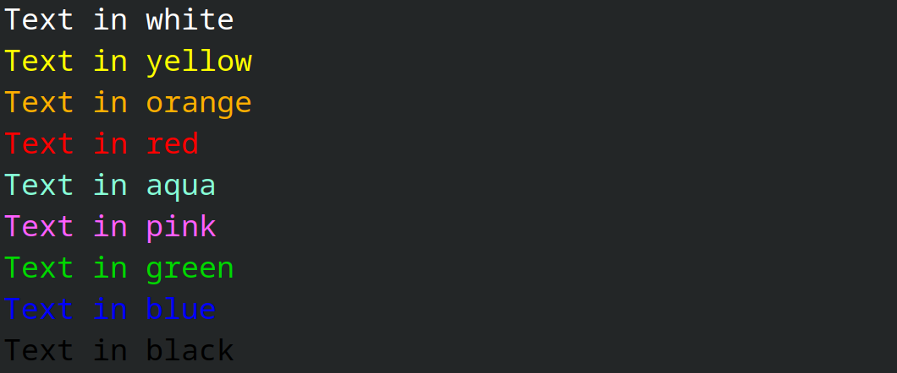
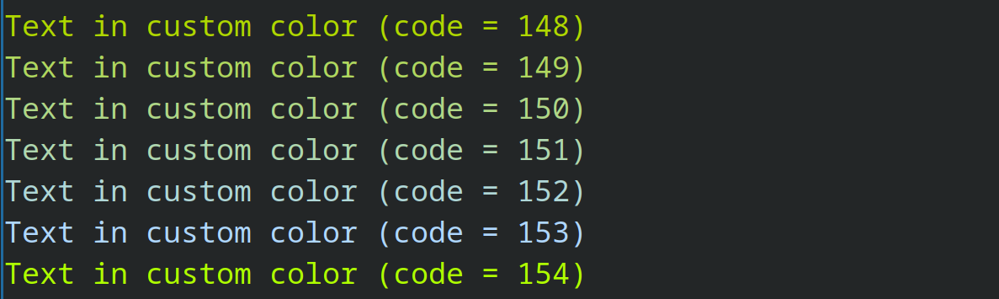
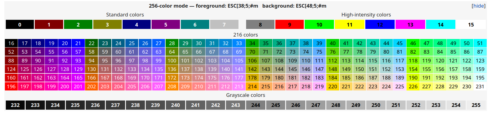

# libdio

Input / Output library for the PRG1F course. Smart abstractions to ask for user inputs, and display things to the console (colors, display grid).

## Usage

To use this library in your code, you have to add the following lines in your `CMakeLists.txt`:

```cmake
include(FetchContent) # once in the project to include the module

FetchContent_Declare(libdio
        GIT_REPOSITORY https://github.com/HEIGVD-PRG1-F-2022/libdio.git
        GIT_TAG v0.1.10
        )
FetchContent_MakeAvailable(libdio)

# Here are your other declarations, like `add_executable`

# Replace `PROJECT` with the name of your executable
target_link_libraries(PROJECT PRIVATE libdio)
```

Now you can do the following to include the library in your files:

```c++
#include <libdio/display.h>
#include <libdio/input.h>
```

## Features
See a code example [here](example/main.cpp).

### Display text and colors
The Display class can be used with or without an object.

**Support of colors**
libdio supports ANSI colors, and a few common colors are included. Here is the full list and their ANSI codes
```cpp
enum Colors {
	WHITE = 15,
	YELLOW = 226,
	ORANGE = 214,
	RED = 196,
	AQUA = 122,
	PINK = 207,
	GREEN = 40,
	BLUE = 21,
	BLACK = 16
};
```
And a visual test of these colors:


But you can cast any integer value of an ANSI color to get a custom color that is not listed above. For example with the color 148:
```cpp
Display::showText(msg, (Display::Colors) 148);
```


All the following ANSI codes can be used!

*Source: [8 bit ANSI codes on Wikipedia](https://en.wikipedia.org/wiki/ANSI_escape_code#8-bit)*


### Display grids

## Images

(Les images ont été prises durant la beta et ne sont pas représentatives du produit final)


